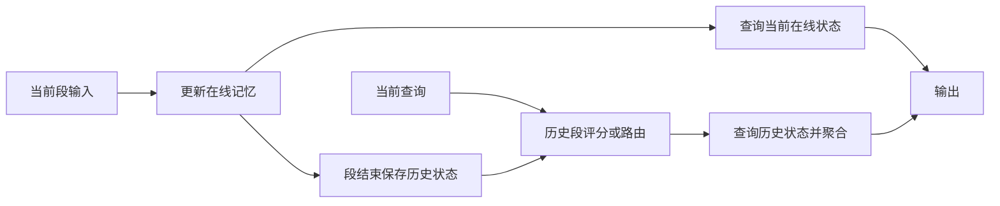

# Memory Caching：用分段状态缓存增强线性 RNN 的长程召回

固定大小的递归状态能让模型以较低的单步成本处理长序列，却必须把越来越多的历史压入同一容量。Memory Caching（MC）为递归模型保存分段状态，并按当前查询读取历史检查点，让有效记忆容量随序列增长。以下机制及实验均依据 Behrouz 等人的论文 v1，核查日期为2026年9月6日；论文发表于2026年2月27日。[原论文](https://arxiv.org/html/2602.24281v1)

## 先分清状态容量与计算量

固定层数、隐藏维度、批量与精度后，常规 Transformer 的 KV Cache 容量随历史长度 $L$ 线性增长。密集注意力在训练或 Prefill 中包含 $O(L^2)$ 计算项；缓存已有 K/V 的 Decode 单步扫描历史，注意力计算为 $O(L)$。三者不能混写成“显存和计算都平方增长”。KV 保存投影后的 Key 和 Value，不是原始 Token。

论文讨论的递归记忆包括线性记忆与深度非线性记忆；Linear Attention、Mamba 和 Titans 的内部结构并不相同。固定状态把历史压缩为可更新的记忆，容量不会自动随上下文扩展，长程精确召回因此受到压缩瓶颈约束。MC 改动的是缓存与检索方式，不要求把这些模型都改为同一种传统 RNN。

## 分段写入、缓存与查询

设序列长 $L$、段长 $S$，共有 $N=\lceil L/S\rceil$ 段。第 $s$ 段内照常更新在线记忆；段结束后保存其最后状态。处理当前 Token 时，查询当前段在线状态和可见历史段的检查点，然后聚合输出。缓存内容是模型记忆状态，不是磁盘上的训练权重检查点。

论文第3.4节明确给出两种段间初始化方式：一是从前一段终态继续更新并留存检查点；二是每段从独立初态开始，使该状态压缩本段内容。两种方式都属于框架，不能把“永远接续上一段”写成唯一实现。

训练时，历史状态和当前查询共同参与前向计算，相关梯度路径与缓存保留由具体模型和训练实现决定；不要将推理缓存直接做梯度截断并声称等价训练。推理时，只能查询当前位置之前已完成段及当前在线状态。服务侧需按独立序列管理状态，重用到无关请求会改变模型输入；这是部署边界，不是论文验证过的服务实现。

## 四种聚合策略

| 方法 | 保存什么 | 选择方式 | 聚合与成本 |
| --- | --- | --- | --- |
| Residual Memory | 历史段末记忆 | 全部历史段 | 查询各段后相加；线性记忆下会退化为可合并的固定状态，缺少依输入变化的选择能力。 |
| Gated Residual Memory（GRM） | 段末记忆与段内容摘要 | 对当前输入与各段摘要评分 | Softmax 得到依输入变化的权重，再聚合各段查询结果；查询成本随段数增长。 |
| Memory Soup | 可作为参数组合的记忆状态 | 依输入加权 | 先加权组合记忆参数，再用当前 Query 查询组合后的记忆；非线性模块下与输出加权不同。 |
| Sparse Selective Caching（SSC） | 记忆状态及段摘要 | 对历史段评分，选择 Top-k | 只加载、查询选中的记忆；评分和选段仍随历史段数增长，不能说完整检索成本固定。 |

正式全称 **Gated Residual Memory** 见论文第3.1节。GRM 的摘要可由段内 Token 表示均值构成，论文还讨论其他池化方式；摘要是路由依据，不等于完整记忆内容。

SSC 的优势是减少实际加载和查询的大型记忆状态，而不是省去对所有摘要的评分。固定 $k$ 只限制选中记忆的数量；若共有 $N$ 段，直接评分仍需处理 $N$ 个摘要。论文第3.3节说明摘要可预先计算，路由可以并行，未选中的记忆也不必全部驻留加速器。

## GRM 与 Memory Soup 何时等价

设查询为 $q$，第 $s$ 段线性记忆为 $M_s$，两种路径使用相同权重 $w_s$，则分配律给出：

$$
\sum_s w_s(M_s q)=\left(\sum_s w_sM_s\right)q.
$$

等价需要查询算子对记忆参数线性，不能只看状态更新规则是否线性。论文第3.2节指出，DLA 与 Titans 的深度或非线性记忆通常不满足这个条件：先混合多个 MLP 的参数再前向，与多个 MLP 前向结果加权并不相同。原稿将 DLA 当成当然满足线性条件的例子不成立。

## 段长、容量与树状分段

每份记忆占固定容量 $m$ 时，缓存规模约为 $O(Lm/S)$。若查询一份记忆成本为 $c$，全段查询的单步额外成本约为 $O(Lc/S)$，完整序列的聚合计算含 $O(L^2c/S)$ 项；这些表达固定维度、忽略边界常数，尚未包括主模型的其他运算。

短段降低单段压缩压力、增加检查点和查询成本；长段减少缓存，但要求单段状态承载更多信息。整段只有一个在线状态时回到固定记忆的极端。论文第3.5节是在**段长为1、特定向量值且无 Value 的记忆形式**下推导出门控全局注意力，不意味着任意 Mamba/Titans 设 $S=1$ 就与普通 Transformer 结构相同。

论文第4节比较等长分段与 Fenwick 树式对数分段；后者减少访问段数，使全序列复杂度含 $O(L\log L)$ 项，却让某些很长历史段压缩到单个状态。论文第5.2节把其召回劣势归因于这种分辨率分配。该解释与对应消融相关，不能当作所有树状记忆必然劣于等长分段的定理。

## 论文实验支持什么

下表来自论文 v1 **Table 2 的 S-NIAH-3（UUID）16K 列**，是准确率百分数，不混用 passkey 或数字召回设置：

| 模型 | 原始模型 | 加 GRM | 变化 |
| --- | ---: | ---: | ---: |
| DLA | 4.0% | 18.2% | +14.2个百分点 |
| Titans（LMM） | 21.2% | 32.2% | +11.0个百分点 |
| Transformer | 40.8% | 不适用 | 仍高于上述两项GRM结果 |

论文第5节说明该类召回实验采用16K训练上下文。它表明MC缩小了这些递归模型与Transformer在特定召回任务上的差距，未消除全部差距。

常识推理采用另一套设置：**Table 1，1.3B参数、100B训练Token、4K训练上下文、默认段长256**。表中 Avg 是各列下游准确率的平均，不是困惑度：

| 模型 | Avg |
| --- | ---: |
| Transformer++ | 53.19% |
| Samba | 54.46% |
| DLA + GRM | 55.96% |
| Titans（LMM） | 56.82% |
| Titans + GRM | 58.33% |

Titans + GRM 相对自身基线提高1.51个百分点，相对Transformer++提高5.14个百分点。原稿中的Samba 56.12、DLA + GRM 49.25、Titans 51.87不符合该表，不能沿用。该结果不证明所有规模、任务和部署环境都能获益。

## 来源

- [Behrouz 等，Memory Caching: RNNs with Growing Memory，v1](https://arxiv.org/html/2602.24281v1)：第3.1–3.5节机制与等价条件，第4节分段复杂度，第5节实验设置，Table 1/2结果。
- [原视频](https://www.bilibili.com/video/BV1GHP4zZESk)：中文文章主题与原始教学顺序；机制名称、表格数字以论文v1纠正。
