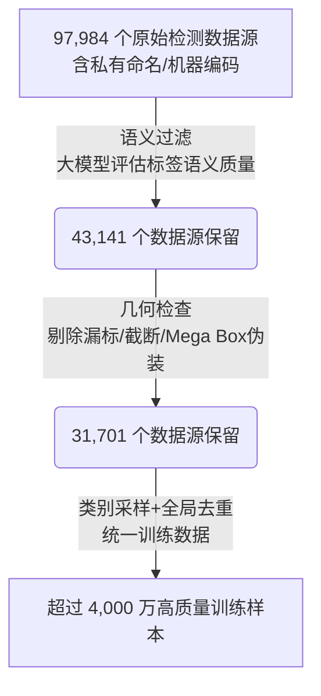
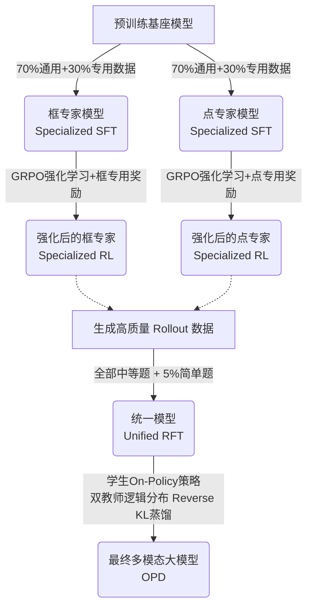

# DeepSeek 视觉原语：从指代、架构到训练与奖励

本文依据第三方存档保存的、署名DeepSeek-AI、北京大学与清华大学的技术报告《Thinking with Visual Primitives》，讨论多模态模型怎样把点和边界框用于推理。它指出的关键问题并非模型能否看见更多像素，而是模型能否稳定地说明自己正在引用图像中的哪个对象。

> 来源边界：本轮已读取并保存完整PDF，核对机制与表格；所取仓库自述为克隆，并非当前官方发布渠道。本地原件和存档提交列于文末，不据此证明当前产品已发布。

## 视觉指代问题：从感知缺口到指代断裂

多模态模型的常见改进路线主要针对 **Perception Gap（感知缺口）**：提高输入分辨率、动态切图或增加视觉 Token，让模型看清小目标与细节。但这些方法不能保证模型在语言推理链中稳定引用已经看见的对象。

技术报告把这个问题称为 **Reference Gap（指代断裂）**。在复杂结构推理中，自然语言的描述容易产生歧义。例如数三只熊时，传统模型即使看见了熊，在生成“左边那只”“树上那只”等文本中间变量时，内部指向也可能发生漂移，最终导致推理崩溃。

视觉原语的核心思路，是把“框”和“点”提升为推理链中的最小思维单元。像人在数数时用手指辅助一样，模型在推理中显式写出实体的坐标锚点。坐标先进入推理过程，后续的空间判断、计数或属性分析都围绕这些稳定指针展开，把视觉空间变成了可写入和再次引用的地址空间。

## 框点表示与坐标

技术报告定义了两种视觉原语：
- **边界框（Bounding Box）**：由左上角和右下角两个点定义，适合数数、定位具有明确实体边界的对象。因为框本身包含两个角点，它的表达能力比单点更丰富，并在表示上天然包容了点（能退化为点）。
- **点（Point）**：由单个坐标定义，适合迷宫导航、线路追踪等难以用单个矩形包围的拓扑或连续轨迹结构。

**序列化与量化绑定方式**（报告第2.3.4节）：坐标归一化到0～999整数。框格式为 `<|ref|>TARGET<|/ref|><|box|>[[x1,y1,x2,y2],[x3,y3,x4,y4]...]<|/box|>`；点格式为 `<|point|>[[x1,y1],[x2,y2]...]<|/point|>`，点任务不要求输出对象名称，以便表示抽象轨迹。这里按正文格式保留ASCII竖线；报告图例中还出现全角竖线排版，不能把排版差异当作已验证的分词器ID。模型权重未在此复现。

## 架构与压缩链路

系统采用类 LLaVA 的拼接架构：图像由从头训练的、支持任意分辨率的 DeepSeek-ViT 提取特征，语言端使用总参数 284B、激活参数 13B 的 DeepSeek-V4-Flash MoE 模型处理拼接后的图文序列。

报告第2.2节用以下两层压缩控制图像表示与缓存成本：
1. **ViT 端空间压缩（Prefill 前）**：在特征提取尾部，每 9 个相邻的 Patch 经过 $3\times3$ 空间合并成 1 个视觉 Token。系统限制单张图片最终输出的视觉 Token 为 81～384，超出则等比例缩放原图。
2. **模型端 CSA 压缩（KV Cache 内）**：在语言模型的注意力缓存中，通过 Compressed Sparse Attention (CSA)，每 4 个视觉 Token 被进一步压缩成 1 个 KV 条目。

**完整形状链与 7056× 缩减**：
一张 $756\times756$ 像素的图像包含 571,536 个像素点。
经过 $14\times14$ 切分，得到 $54\times54=2,916$ 个 Patch Token。
再经 $3\times3$ 空间合并，送入语言模型 Prefill 阶段的缩减为 324 个视觉 Token。
最终经 CSA 压缩，只保留 81 个视觉 KV 条目。

$571{,}536\ \text{pixels}\rightarrow2{,}916\ \text{patch tokens}\rightarrow324\ \text{LLM visual tokens}\rightarrow81\ \text{KV entries}$

最终数字（7056 倍）是像素点数与最终缓存条目数之间的工程削减口径，**不是无损的信息压缩率**。在这套链路下，一张 $800\times800$ 的图像只产生约 90 个 KV 条目，远低于 Claude Sonnet 4.6 (约 870 个) 和 Gemini 3 Flash (约 1100 个)。

## 视觉原语的训练：数据过滤、专家合并与密集奖励

数据扩展优先框：标注更确定、含位置与尺度、可迁移到点表示。它是报告第2.3节的设计理由，未给出框退化成点的固定转换算法。报告第2.4.2节还加入目标不存在的问答负样本，使模型依视觉证据拒答；不能把这一做法混入前面的4000万检测样本漏斗。

大模型输出坐标并不难，难的是在大规模、多领域场景中输出几何可信、语义对齐的坐标轨迹。

### 数据过滤与扩展（漏斗流）

为了把粗糙的检测监督改写为“语言-区域对齐”的高质量推理数据，数据构建经过了严格的过滤漏斗：

*(注：前三步单位是数据源数，最终产出单位是具体生成的样本数。)*

### 四阶段后训练流程

若直接混合框定位（离散对象集合）和点轨迹（连续拓扑顺序）进行训练，容易引发模式冲突。模型采取了分专家的四阶段后训练：

1. **Specialized SFT**：框与点分流训练，掌握各自输出格式。
2. **Specialized RL**：分离使用 GRPO 继续训练，主要选择N次Rollout中正确次数满足1≤k<N的中等题。RL不再逐个提供思考中框点的人工真值监督，而由格式、质量和任务奖励检查生成行为。
3. **Unified RFT**：利用两个专家 Rollout 采样构建数据，重新从预训练基座初始化并训练统一模型，不是直接把两个专家权重相加。抛弃难以学习的极困难题，保留所有中等题并加入 5% 简单题防止灾难性遗忘。
4. **On-Policy Distillation (OPD)**：由于统一模型与专家仍有差距，学生模型沿自身当前策略探索状态（On-Policy），两名专家在生成的步骤上提供全词表参考概率，通过 Reverse KL（逆向 KL 散度）进行蒸馏学习，确保学生不会仅在固定正确路径上模仿。

### 三层密集奖励

传统的最终答案奖励信号过于稀疏，无法监督复杂的中间思考。视觉原语设计了三层机制：
- **格式奖励**：检查边界框语法合法性并惩罚重复框死循环。
- **质量奖励**：利用语言模型作为裁判，检查指代是否有意义、思维是否冗余或自相矛盾、是否存在伪造真值。
- **准确性奖励（按任务选择程序化或模型检查器）**：
  - **计数任务**：报告第2.5.2节式(1)为 $R(\hat y,y)=0.7\exp(-3|\hat y-y|/(|y|+1))$。真值50、预测51时约0.6600，预测5时约0.0496；这是公式复算，不是训练实测。空间推理与通用VQA则使用模型奖励并平均思考和答案得分，不能统称程序检查。
  - **迷宫导航**：采用严格的因果探索截断。一旦模型写出一次穿墙坐标，此后所有探索在因果上均视为无效，直接停止后续进度奖励核算。最终综合考量合法探索范围、穿墙次数和最终路径连贯性。
  - **路径追踪**：采用类似**双向 Chamfer Distance** 的匹配算法：
    - 正向匹配（预测点向真实线算最小距离）：防止模型“乱走”偏离真实线路。
    - 反向匹配（真实点向预测线算最小距离）：防止模型投机“漏走”，避免它只在起点和终点附近输出极少量安全点而跳过中间复杂交叉区域。

## 实验条件与能力边界

以下为报告Table 1：CountQA引用EM列，其余引用ACC列；第3.3节规定低于640000像素的图像等比例放大到该阈值，并对支持预算设置的模型使用low。第3.1节还说明预训练64K/FP8、后训练256K；专用SFT/RL使用FP8，统一RFT/OPD使用MXFP4。不同精度与阶段不可混写。

在限定**低推理预算**并且使用相同提示词的基础公平评估下：
- **常规空间/计数任务表现持平**：CountQA (本文 64.9 vs Gemini-3-Flash 66.1)、CV-Bench (88.4 vs 88.6)、OmniSpatial (59.5 vs 59.6)。
- **连续轨迹拓扑任务拉开差距**：DS_Maze_Navigation 达到 66.9%（同等条件 GPT-5.4 仅 50.6%），DS_Path_Tracing 达到 56.7%（GPT-5.4 仅 46.5%）。

**视觉原语的核心边界**：
尽管极大地提升了表现，视觉原语并不能完美解决所有的拓扑问题（迷宫任务使用了 46 万条冷启动样本，最终准确率依然只在 66.9%；路径追踪使用 12.5 万条冷启动样本，最终 56.7%）。这种机制依赖三个隐含约束：
1. **可靠的坐标指代**：透明物体、群聚边界或细长条，经常无法用方正的框或独立的点完美提取无歧义坐标。
2. **高分辨率前置条件**：缩放与视觉 Token 的高倍压缩若导致小目标从特征层面上彻底丢失，后续的所有精准输出都是无用功，它不能替代底层感知。
3. **跨语言边界**：报告第3.4.1节明确说视觉原语后训练数据不含中文，并展示中文思考与回答，作者归因于基座多语言能力；这不代表全部预训练数据不含中文。
4. **触发与消融边界**：第4节承认依赖显式触发词、细粒度场景原语仍不准确。该存档没有逐组件消融表，不能给视觉原语、分专家训练、OPD和CSA各自编造独立收益。

落地时应分别核查坐标可解析、对象真实存在、路径连通，以及原语与最终答案一致；这些是从报告检查器提炼的工程检查，不是已实现或已验证的部署系统。

## 来源与版本

| 来源 | 版本与定位 | 支持范围 |
| --- | --- | --- |
| [Thinking with Visual Primitives存档PDF](https://github.com/mitkox/Thinking-with-Visual-Primitives/blob/main/Thinking_with_Visual_Primitives.pdf) | [存档提交aaeec2fa87096f66782acb6270e4a43bb4e61757](https://github.com/mitkox/Thinking-with-Visual-Primitives/commit/aaeec2fa87096f66782acb6270e4a43bb4e61757)；存档说明报告日期2026-04-30；2026-09-07核查 | 第2.2节架构/压缩；2.3节数据/格式；2.4节冷启动；2.5节训练/奖励；Table1、第3.3节评测；第4节限制。 |

| [上篇原视频](https://www.bilibili.com/video/BV15j5u6WE5C) | 唐国梁Tommy，2026-05-12 | 动机、架构与中文教学案例。 |
| [下篇原视频](https://www.bilibili.com/video/BV1YXLp6FE8V) | 唐国梁Tommy，2026-05-17 | 数据、训练、奖励与边界。 |
