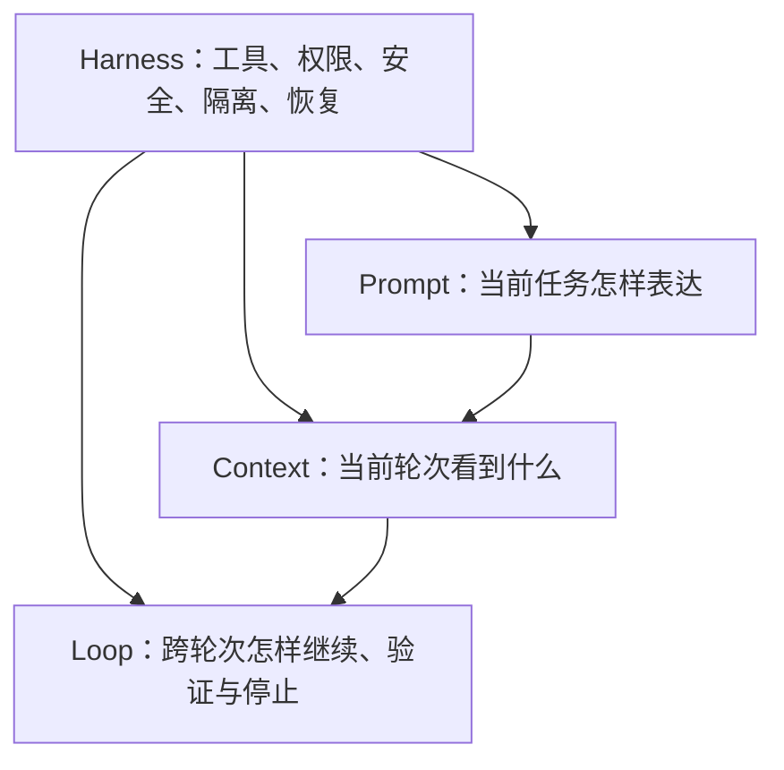

# 循环工程：从逐轮操作到外部调度

循环工程管理跨轮次决策流：系统在一次执行结束后，自行触发下一轮、组织分工、检查结果、保存状态，并决定继续或停止。人的职责由逐轮操作转向定义目标、边界、证据、预算、停止和恢复机制。（[[wiki/sources/循环工程：先导篇 从 Prompt 到 Loop|先导篇]]、[[wiki/sources/循环工程：第一期 什么是 Loop Engineering？|第一期]]）

## 三层递进与 Harness 外壳

先导篇把 Prompt、Context、Harness 和 Loop 描述为四层，用于预告系列路线；第一期明确把结构精化为 Prompt、Context、Loop 三层递进，Harness 包住三层。知识库采用后续精化模型，同时保留来源中的表述演进。（[[wiki/sources/循环工程：先导篇 从 Prompt 到 Loop|先导篇]]、[[wiki/sources/循环工程：第一期 什么是 Loop Engineering？|第一期]]）

## 循环成立的条件

多次调用 Agent 不等于循环。一个可持续循环至少需要：

1. **自行触发**：根据时间、事件或状态启动下一轮。
2. **组织执行**：拆分任务，必要时调度多个 Agent 协作。
3. **独立验证**：由生成者之外的评判器根据证据决定是否通过。
4. **持久反馈**：把结果和未完成状态写入对话之外的载体。
5. **停止与恢复**：明确完成、中止、预算和回退条件。

缺少触发，系统仍依赖人的下一条指令；缺少状态写回，各轮彼此断开；缺少独立验证和停止条件，系统只能持续运行，无法证明任务已经完成。（[[wiki/sources/循环工程：第一期 什么是 Loop Engineering？|第一期]]、[[wiki/sources/循环工程：第四期 搭好 Loop ≠ 能上线？|第四期]]）

## 五个动作与六个组件

| 动作 | 目标 | 主要组件 |
| --- | --- | --- |
| 发现 | 从 CI、Issue、Commit 和稳定规则中识别问题 | Automations、Skills |
| 交付 | 在隔离环境中完成修改 | Worktrees、Sub-agents |
| 验证 | 根据测试和行为证据独立判定 | Sub-agents、Skills、测试工具 |
| 持久化 | 交付结果并保存下一轮状态 | Connectors、Memory |
| 调度 | 自动开始下一轮 | Automations |

六个组件不是工具清单，而是闭环中的职责分配。Harness 提供执行环境；只有调度、验证和结果回流同时存在，单次 Harness 执行才会成为 Loop。（[[wiki/sources/循环工程：第三期 Loop 该怎么搭？|第三期]]）

## 三种自治哲学

| 流派 | 人的职责 | 主要机制 | 适用边界 |
| --- | --- | --- | --- |
| 结构化流派 | 保留验证、隔离和最终决策 | 独立评判器、Worktree、人工卡点 | 高风险或需要明确责任的任务 |
| 极端流派 | 减少逐轮干预，依靠外部反馈收敛 | 单任务循环、规格重载、测试与类型系统 | 从零启动、反馈明确的绿地项目；不适合已有代码库 |
| 精准修正流派 | 识别重复引导并判断自动化经济性 | Skill、CI、模板、自动任务、盈亏平衡公式 | 复用次数和维护收益足以覆盖建设成本 |

三种流派的分歧不是工具能否运行，而是人能从循环中退出多远。自治程度越高，外部验证、状态隔离、预算和人工责任越重要。（[[wiki/sources/循环工程：第二期 三大流派与四笔代价|第二期]]）

## 评判器必须与生成者分离

生成者的上下文保存完整实现理由，容易把自身意图当成结果证据。独立评判器需要三种隔离：

- **上下文隔离**：不继承生成者的自我说服过程。
- **职责隔离**：采用审查指令，必要时更换模型。
- **证据隔离**：通过单元测试、编译、类型检查、页面操作、DOM 和截图验证结果。

Ralph 的单元测试、类型系统和静态分析三层 Backpressure 体现同一原则：继续运行的权力由外部证据授予，而非由刚完成工作的 Agent 自行决定。（[[wiki/sources/循环工程：第三期 Loop 该怎么搭？|第三期]]）

## 四笔代价与控制措施

| 代价 | 形成机制 | 控制措施 |
| --- | --- | --- |
| 验证债 | 产出速度超过审查速度 | 独立评判器、质量门禁、限制并发产出 |
| 理解腐烂 | 系统变化超过人的吸收速度 | 状态说明、评审节奏、限制变更范围 |
| 认知投降 | 人停止形成自己的判断 | 人工复核点、明确责任、保留否决权 |
| Token 失控 | 缺少预算、轮次和重试边界 | Token 上限、最大轮次、停止条件 |

四者会沿反馈链累积：弱评判器产生验证债，未验证变化导致理解腐烂，理解缺口诱发认知投降，持续运行又扩大 Token 消耗。（[[wiki/sources/循环工程：第二期 三大流派与四笔代价|第二期]]）

## 自动化经济性

第二期资料用以下条件判断一项循环是否值得建设：

`P × N × (S + R) > F`

`F` 是建设成本，`N` 是复用次数，`S` 是每次节省的注意力或时间，`R` 是避免的风险或返工，`P` 是循环持续有效并被使用的概率。长期计算还必须纳入工具、仓库、模型和需求变化带来的维护成本与衰减。

当执行速度超过人产生、排序和审查想法的速度，瓶颈会从执行转为判断。资料把这一转折称为执行视界；它说明循环越快，越需要限制范围和提高评判能力，而不是继续扩大产出。（[[wiki/sources/循环工程：第二期 三大流派与四笔代价|第二期]]）

## 从能运行到能上线

最小搭建路线是：建立触发、接入发现源、保存状态、安装独立评判器、隔离并行工作区。上线前还需完成六项检查：（[[wiki/sources/循环工程：第四期 搭好 Loop ≠ 能上线？|第四期]]）

1. 发现源明确。
2. 跨轮状态保存在仓库文件中。
3. 存在能够拒绝结果的独立 Evaluator。
4. 并行任务使用隔离 Worktree。
5. 设置 Token 或预算上限。
6. 明确必须由人复核的步骤。

前两项让循环能够运行，后四项限制运行后的风险。循环范围可以先小，但评判、预算和人的最终责任不能省略。

## 从循环要求选择 Agent 框架

框架选型应从循环需要的控制能力出发，而不是先比较框架热度。2026 年 3 月的一份框架生态资料把主要方案分为图状态机、角色驱动、事件驱动、SDK 封装与低代码五种范式：LangGraph 偏复杂状态和精确控制，CrewAI 偏角色协作与快速原型，LlamaIndex 偏数据密集型流程，PydanticAI 偏类型安全，Dify 偏低代码交付；Microsoft Agent Framework、Google ADK 与 AgentScope 还分别受到企业技术栈、云平台与国内部署生态影响。（[[wiki/sources/AI Agent 框架选型：十大框架与五大范式|AI Agent 框架选型]]）

这些框架不能替代循环成立所需的触发、状态、验证、停止和恢复机制。选型时先确定团队技术栈、核心场景、部署平台和模型偏好，再核算托管、解析、可观测性、权限与云服务成本。资料中的版本、协议支持和生态判断具有时间边界，落地前必须重新核对当前官方文档。

## 与 Context 和 Evaluation 的边界

[[wiki/syntheses/上下文工程：有限窗口中的信息治理|Context Engineering]] 为每一轮选择、压缩和隔离信息；Loop Engineering 把多轮执行连接起来。两者在状态写回处相交：Context 决定哪些状态值得重新进入窗口，Loop 决定何时读取、怎样继续以及何时停止。

[[wiki/syntheses/评估工程：从通用基准到业务质量门|Evaluation Engineering]] 接管“凭什么继续”。循环工程要求 Maker 与 Checker 分离，评估工程进一步为 Checker 提供真实数据、黄金标准、评分方式和质量门禁。执行完成不等于任务合格，只有通过独立评估的结果才能继续传播或进入生产。

## 来源边界

- 297 美元 API 成本交付 5 万美元合同属于来源个案，不代表一般回报率。
- Ralph 的资料边界是从零启动的绿地项目，不能直接外推到已有代码库。
- `/loop`、`/goal`、`--worktree` 等命令属于资料发布时的工具状态，使用前需核对当前版本。

## 资料链

- [[wiki/sources/循环工程：先导篇 从 Prompt 到 Loop]]
- [[wiki/sources/循环工程：第一期 什么是 Loop Engineering？]]
- [[wiki/sources/循环工程：第二期 三大流派与四笔代价]]
- [[wiki/sources/循环工程：第三期 Loop 该怎么搭？]]
- [[wiki/sources/循环工程：第四期 搭好 Loop ≠ 能上线？]]
