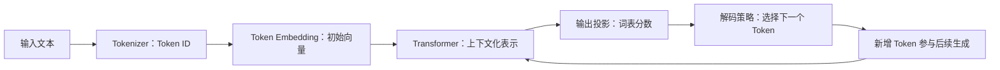

# 模型推理：从 Token、Latent 到多模态交错思维

理解模型推理，先沿着一次输入看它怎样变成表示、经过计算、再生成输出，然后区分三件事：信息怎样表示、一次任务投入多少计算、这些计算怎样高效执行。增加参数、增加思考步骤和提高生成速度作用于不同环节，不能互相代替。（[[wiki/sources/大语言模型：Token、Embedding 与 Latent Space|表示与生成]]、[[wiki/sources/大语言模型：思维链如何用 Token 换取推理计算|测试时计算]]、[[wiki/sources/模型推理优化：DSpark 投机解码|执行优化]]）

## 一次文本生成的数据流

图示概括自回归文本生成的依赖关系，不代表每步都重新计算全部历史。Tokenizer 决定离散切分，Embedding 提供初始向量，Transformer 形成上下文化 Hidden State，输出投影得到词表 logits，再由解码策略选择下一项。KV Cache 可以复用已处理历史的中间状态。（[[wiki/sources/大语言模型：Token、Embedding 与 Latent Space|表示链路]]、[[wiki/sources/模型架构：Transformer 编码器、解码器与模型分支|生成与采样]]、[[wiki/sources/模型推理优化：KV Cache 与 Prompt Cache 的复用层级|历史状态复用]]）

原始 Encoder—Decoder 先编码输入，再逐步生成目标序列；Decoder-only 根据已有 Token 继续生成；Encoder-only 的注意力范围与训练目标不同，不应把这条自回归输出链原样套到所有 Transformer。架构区别见 [[wiki/sources/模型架构：Transformer 编码器、解码器与模型分支#三种架构路线|三种基础路线]]。

## Token ID、Token Embedding 与 RAG Embedding

Token ID 是词表编号；Token Embedding 是模型参数中的初始表示；Hidden State 是经过当前上下文计算后的状态。Residual Stream、层内 Activation、KV Cache 与 logits 又处在不同计算位置，把它们统称为“隐藏空间”会失去具体含义。RAG Embedding 则服务于检索，其训练目标与聚合方式不同，不能把任意生成模型的 Hidden State 直接当成合格的检索向量。（[[wiki/sources/大语言模型：Token、Embedding 与 Latent Space|表示位置与用途]]）

分词在词表大小、序列长度和未知文本覆盖间取舍。BPE 等方法改变模型首先接收到的信息单元；可见文本重新分词的数量也不必等于 API 的全部输出计量。算法与抓包计数留在 [[wiki/sources/大语言模型：Tokenizer、Token ID 与 BPE|Tokenizer 专题]]，不能由一次计量差值推出跨版本固定开销。

## 注意力怎样形成上下文表示

Query 与 Key 的匹配经缩放和 Softmax 形成权重，再对 Value 加权汇总；多头使用不同投影学习关系，自回归模型用因果 Mask 限制未来信息。这解释了上下文怎样影响当前位置，却不意味着每个头都对应人可命名的“语法”或“语义”。（[[wiki/sources/模型架构：多头注意力与 QKV|注意力与 QKV]]）

顺序信息还需要位置机制。正弦位置编码在输入表示中加入位置，RoPE 在投影后旋转 Query／Key，使点积中的位置关系由相对位移表达。代数结构不同不直接证明跨任务性能优劣；推导分别见 [[wiki/sources/模型架构：正弦位置编码与注意力的顺序缺口|正弦位置编码]] 与 [[wiki/sources/模型架构：RoPE 相对位置与旋转点积|RoPE]]。

### Linear、Activation 与 MLP 提供基础变换

Linear 执行向量映射，Activation 引入非线性，FFN／MLP 继续变换每个位置的表示。参数来自训练；推理使用这些参数处理当前输入。梯度下降、训练循环与保存加载属于参数怎样获得和验证的问题，详见 [[wiki/sources/模型架构：Linear、Activation 与 MLP|基础变换]]、[[wiki/sources/模型训练：梯度下降与均方误差|梯度下降]] 与 [[wiki/sources/模型训练：PyTorch 手写数字识别实战|MNIST 完整实践]]。

MNIST 的现存原文已包含独立测试和保存加载验证，不能再描述为只有训练集单例；具体结果绑定所列运行环境。本页保留训练与推理的分工，训练顺序及结果见 [[raw/sources/模型工程/训练与后训练/用 PyTorch 搭建并训练 MNIST 手写数字识别模型#独立测试与保存加载结果|独立测试记录]]。

## 容量、序列与深度是不同的改动位置

| 改动位置 | 机制与作用 | 必须保留的区别 | 展开位置 |
| --- | --- | --- | --- |
| FFN 容量 | MoE 为每个 Token 路由少量专家 | 总参数不等于激活参数；路由、分发与负载均衡仍有成本，FLOPs 不等于端到端延迟 | [[wiki/sources/模型架构：MoE 稀疏专家路由|MoE 容量]]、[[wiki/sources/模型架构：MoE 路由、Top-K 与负载均衡|路由与训练]] |
| 参数化记忆 | Engram 按输入 N-gram 查表，门控后注入主干 | 查找训练所得参数表不同于 RAG 检索外部文档；CPU 预取也有搬运成本 | [[wiki/sources/模型架构：Engram 参数化记忆查找|Engram]] |
| 历史序列 | KV 共享、稀疏筛选、压缩、混合注意力与分段记忆 | 减少 KV Head、筛选位置和压缩序列是不同操作，不能把节省比例直接当作速度提升 | [[wiki/syntheses/长上下文模型架构：共享、筛选、压缩与可增长记忆|长上下文机制对照]] |
| 网络深度 | Attention Residuals 选择此前层表示；mHC 约束多通道混合 | 层间选择不同于 Token 间注意力，也不同于优化器更新或专家负载控制 | [[wiki/syntheses/深层模型训练稳定性：残差、更新与路由|训练稳定性]]、[[wiki/sources/模型架构：Attention Residuals 层间选择性聚合|AttnRes]] |

这些改动可以组合，效果必须落回完整模型。DeepSeek V4 的压缩与稀疏、Qwen 3.5 的混合注意力、Kimi K2 Thinking 的 MoE／MLA 与量化，分别改变不同数据流。具体配置与证据见 [[wiki/sources/模型架构：DeepSeek V4 的长上下文与训练稳定性|DeepSeek V4]]、[[wiki/sources/大语言模型：Qwen 3.5 的 MoE、混合注意力与应用演示|Qwen 3.5]]、[[wiki/sources/大语言模型：Kimi K2 Thinking 的 MoE 架构与 Agent 训练|Kimi K2 Thinking]]；不能把三篇不同设置的数字拼成统一排名。

## 推理表示应跟随任务需要

| 路线 | 中间信息怎样存在 | 能检查什么 | 主要边界 |
| --- | --- | --- | --- |
| 文本 CoT | 将解题步骤生成成后续可读取的 Token | 可见步骤、答案及其一致性 | 增加生成与上下文成本，不保证忠实反映内部计算 |
| Latent Reasoning | Coconut、Soft Thinking 等将部分步骤保留在连续状态 | 需额外解释或干预工具分析 | 隐藏步骤仍需前向计算，可见 Token 少不等于总计算少 |
| 多模态交错推理 | ThinkMorph 交替生成文本与视觉中间状态 | 文本规划、图像操作和结果 | 依赖视觉信息与任务，额外图像步骤有成本 |

上述区别来自 [[wiki/sources/大语言模型：Token、Embedding 与 Latent Space|连续表示与隐藏计算]]、[[wiki/sources/大语言模型：思维链如何用 Token 换取推理计算|思维链计算]] 与 [[wiki/sources/多模态推理：ThinkMorph 交错思维链|ThinkMorph]]。它们可以共存：可见中间步骤仍经模型内部连续计算，不能当作互斥架构。

视觉输入还要区分“看见、指代、操作、验证”。ViT 编码已有图片，点和框减少指代漂移，ThinkMorph 生成可见中间图像；增加分辨率无法代替稳定指代和动作验证。完整衔接见 [[wiki/syntheses/多模态推理闭环：感知、指代、操作与验证|多模态闭环]]，原始机制见 [[wiki/sources/多模态模型：ViT 图像分块与编码|ViT]]、[[wiki/sources/多模态推理：DeepSeek 视觉原语|视觉原语]] 与 [[wiki/sources/多模态模型：架构、数据、推理与检索|多模态技术地图]]。

## 可见思维链首先增加的是 Token 计算次数

普通 Transformer 生成每个 Token 时经过固定层数。把相关解题步骤写成更多 Token，会增加前向次数，并把中间结果交给后续生成；这增加测试时计算，不增加参数，也不自动保证结果正确。资料还保留极小模型上额外格式可能成为负担的例外。（[[wiki/sources/大语言模型：思维链如何用 Token 换取推理计算|计算预算与模型边界]]）

自我一致性和 Verifier 在多次生成后选择答案，主模型参数不因选答更新；STaR、奖励驱动训练与蒸馏才涉及新的学习过程。提示和采样的选择见 [[wiki/syntheses/提示词工程：从单轮指令到生产规范|提示词工程]]，反馈如何用于参数更新见 [[wiki/syntheses/大模型后训练：从模仿到行为选择|后训练]]。Claude Code 的 Thinking 抓包展示预算控制与响应通道，但没有同题开关对照，不能单凭它证明准确率收益。（[[wiki/sources/Claude Code：Thinking 模式、Adaptive 与 Effort|Thinking 案例边界]]）

## 可见思维链与内部计算不是同一对象

DataAlchemy 从任务、长度和格式三个维度展示了分布变化时的退化，还出现可见步骤与答案不一致。它支持可见推理受到训练分布约束的解释，不证明所有模型都缺少抽象推理。流畅步骤既不是内部计算的完整记录，也不是最终答案正确的保证。（[[wiki/sources/大语言模型：思维链的模式匹配与泛化边界|思维链泛化边界]]）

因此需要分开检查答案、步骤、二者一致性和外部证据。SAE、Probe 或 Circuit Tracing 提供观察途径，因果解释还需要干预验证；内部激活不能直接解释为人类概念或心理状态。（[[wiki/sources/大语言模型：Token、Embedding 与 Latent Space|解释边界]]）

## 表示机制、RAG 推理扩展与执行优化是三条轴

表示机制决定中间信息的形式；DRAG／IterDRAG 决定检索文档、演示和迭代预算；投机解码优化生成执行。前者可能改变模型怎样使用信息，第二类增加可见证据和调用，第三类在满足无损条件时保持目标输出分布。它们应分别报告质量、资源投入与服务性能。（[[wiki/sources/上下文工程：DRAG 与 IterDRAG 推理扩展|检索预算]]、[[wiki/sources/模型推理优化：DSpark 投机解码|投机解码]]）

同样，Qwen 3.5 交替使用线性与全注意力，不等于 V4 的先压缩再筛选，也不等于应用层删减文档。两者配置与召回代价的比较由 [[wiki/syntheses/长上下文模型架构：共享、筛选、压缩与可增长记忆#先压缩再筛选|长上下文专题]]承担；应用如何选择材料由 [[wiki/syntheses/上下文工程：有限窗口中的信息治理|上下文工程]]承担。

## 从推理阶段到 API 成本

Prefill 较为并行地处理输入，Decode 逐 Token 生成并读取历史状态。服务优化要先区分计算、存储、访存、调度和计费，避免把所有节省都叫作“减少 Token”。（[[wiki/sources/模型推理优化：Token 成本、KV Cache 与缓存机制|推理阶段与计费]]）

| 机制 | 实际改变什么 | 不能据此认定什么 |
| --- | --- | --- |
| KV Cache／Prompt Cache | 请求内复用历史 K／V，或跨请求复用稳定前缀的 Prefill 状态 | 命中不返回历史答案，也不消除新增后缀、解码和读取成本；[[wiki/sources/模型推理优化：KV Cache 与 Prompt Cache 的复用层级|复用层级]] |
| GQA | 减少每个位置保存的 KV Head | 不减少序列位置；[[wiki/sources/模型架构：KV Cache 显存公式与 MHA、MQA、GQA|显存公式]] |
| FlashAttention | 通过融合、在线 Softmax 与分块减少中间矩阵写入和访存 | 不减少标准注意力的全部分数计算；[[wiki/sources/模型推理优化：FlashAttention 算子融合、在线 Softmax 与 Tiling|算子数据流]] |
| PagedAttention | 分页管理 KV 物理存储，支持前缀共享与块复用 | 不能由某平台计量跳变推出其物理块大小；[[wiki/sources/模型推理优化：PagedAttention 分页、前缀共享与驱逐|分页与共享]]、[[wiki/sources/模型推理优化：Codex 自动前缀缓存|Codex 观察边界]] |
| DSpark | 草稿生成、验证长度与负载调度协同 | 特定线上速度提升不是跨模型保证；[[wiki/sources/模型推理优化：DSpark 投机解码|模型、基线与负载条件]] |
| Batch 与硬件调度 | 合并调度以提高利用率，按带宽、计算和互联瓶颈分配资源 | 吞吐提高不等于单请求等待更短，峰值 FLOPs 不代表实际速度；[[wiki/sources/AI 计算硬件：内存带宽、互联与软件生态|硬件约束]]、[[wiki/sources/模型推理优化：Token 成本、KV Cache 与缓存机制|Batch 与成本]] |

模型生成工具调用后，外部系统还必须执行、授权、检查结果并处理失败。更快生成不自动带来更少工具错误；运行责任见 [[wiki/syntheses/驾驭工程：模型之外的 Agent Harness|Agent Harness]]。任务经济性应计入重试、失败、人工稽核与运维，不能仅比较每百万 Token 单价。（[[wiki/sources/模型推理优化：Token 成本、KV Cache 与缓存机制|任务总成本]]）

### 推理慢、显存高、费用高时先查什么

先固定模型、输入输出长度、精度、硬件或服务平台及并发条件，再分开记录各阶段耗时、显存占用、实际计量和任务成功率。下表是依据上述机制整理的排查顺序；看到一种症状并不能直接确定根因。（[[wiki/sources/AI 计算硬件：内存带宽、互联与软件生态|硬件条件]]、[[wiki/sources/模型推理优化：Token 成本、KV Cache 与缓存机制|成本条件]]）

| 观察到的问题 | 先检查的证据 | 根据证据选择下一步 |
| --- | --- | --- |
| 长输入后等待明显增加 | 输入长度、Prefill 耗时与前缀命中；区分模型计算和请求排队 | 检查无关输入与稳定前缀复用；自管推理服务再检查算子访存。见 [[wiki/sources/模型推理优化：KV Cache 与 Prompt Cache 的复用层级|缓存复用]]、[[wiki/sources/模型推理优化：FlashAttention 算子融合、在线 Softmax 与 Tiling|FlashAttention]] |
| 开始输出后仍生成缓慢 | 输出与思考长度、Decode 速度、批量和内存带宽 | 比较必要推理预算与实际质量；具备部署控制时再评估量化或投机解码，不能由减少可见文字推断总计算减少。见 [[wiki/sources/模型推理优化：DSpark 投机解码|DSpark 的负载条件]]、[[wiki/sources/大语言模型：Token、Embedding 与 Latent Space|隐藏计算]] |
| 上下文或并发一增，显存就紧张 | 分开核算模型权重与 KV；检查序列长度、KV Head、层数、精度和分配碎片 | 先确定占用对象；分页改善分配，KV 共享属于模型结构，二者不能互换。见 [[wiki/sources/模型架构：KV Cache 显存公式与 MHA、MQA、GQA|KV 公式]]、[[wiki/sources/模型推理优化：PagedAttention 分页、前缀共享与驱逐|分页管理]] |
| 单次 Token 单价低，任务账单仍高 | 输入／输出、缓存写入／读取、重试与成功任务数量 | 按完成同一任务的总成本比较模型和工作流；允许延后交付时再考虑 Batch。见 [[wiki/sources/模型推理优化：Token 成本、KV Cache 与缓存机制|任务成本]] |

验证改动时同时观察任务质量、单请求延迟、吞吐和费用。托管 API 用户能调整输入、预算与调用组织；分页、算子和草稿模型等服务内部机制是否可控，须以实际部署能力为准，不把机制名称直接当成可用配置。

## 评估不能只看最终准确率

比较前先固定模型版本、任务、提示与采样条件，再同时记录答案质量、可见与隐藏计算、图像 Token、实际延迟、吞吐和审计能力。涉及工具时还要记录环境、预算与最终状态；数据集、模型或负载不同的提升比例不能直接相加。（[[wiki/sources/大语言模型：Token、Embedding 与 Latent Space|评测边界]]、[[wiki/syntheses/评估工程：从通用基准到业务质量门|系统评估]]）

本库保留各研究的限制：ThinkMorph 的部分模式切换数字有基准归属冲突；视觉原语缺少标准消融，不能独立归因各组件收益；Qwen 3.5 资料没有展开混合注意力精确实现与消融。具体数字和争议应读取对应摘要，不把机制图或教学公式当成统一性能证明。（[[wiki/sources/多模态推理：ThinkMorph 交错思维链|ThinkMorph]]、[[wiki/sources/多模态推理：DeepSeek 视觉原语|视觉原语]]、[[wiki/sources/大语言模型：Qwen 3.5 的 MoE、混合注意力与应用演示|Qwen 3.5]]）
