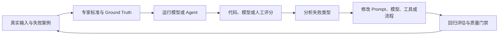

# 评估工程：从通用基准到业务质量门

评估工程把“模型看起来很强”转化为“系统在这项业务中是否可用”。它使用真实输入、独立标准、可重复评分和受控变更，为模型选择、Prompt 修改、Agent 行为和上线决策提供证据。（[[wiki/sources/评估工程：第一期 排行榜遥遥领先，用起来怎么各种拉胯？|第一期]]）

## 评估闭环

总分只表明变化方向，失败案例才说明应修改输出接口、推理方法、知识、工具、环境还是业务规则。成熟评估会把新事故和新边界持续写回数据集，而不是把第一版测试集当成静态答案。

## 最小质量证据

一套业务评估至少包含四部分：

1. 来自真实用户和任务的输入。
2. 由领域专家给出的黄金答案或成功标准。
3. Prompt、模型或 Agent 的实际输出与最终状态。
4. 输出或状态相对标准的评分。

参考答案和成功标准需要领域专家复核及争议处理，不能把单人答案视为绝对正确；合成样例应单独标记和验证。独立标准与循环工程中 Maker 与 Checker 分离共同约束评估偏差。（[[wiki/sources/评估工程：第一期 排行榜遥遥领先，用起来怎么各种拉胯？|第一期]]、[[wiki/syntheses/循环工程：从逐轮操作到外部调度|循环工程综合]]）

## 评分方式选择

| 任务性质 | 优先评分方式 | 适用条件 | 主要边界 |
| --- | --- | --- | --- |
| 固定答案、确定性规则 | 代码评分 | 结果可精确或程序化表达 | 不能处理开放语义 |
| 可文字化的主观标准 | LLM 裁判 | 有明确 rubric、示例和黄金集 | 存在偏见、方差、成本与版本变化 |
| 高频、低延迟、边界稳定的分类 | SLM 裁判 | 数据量足、标准稳定、任务单一 | 标准变化与分布外问题适应较弱 |
| 模糊、高风险或不可完全形式化 | 人工评审 | 需要领域责任和最终判断 | 成本高、速度慢、标注者也会分歧 |

生产系统通常组合使用四种方式：代码承担确定性检查，SLM 覆盖稳定高频流量，LLM 处理复杂语义和低置信度升级，领域专家负责黄金标准、校准、抽检和高风险终审。

## 代码评分：先定义输出语义

精确字符串匹配适合单值和固定格式答案；集合匹配适合顺序不承载意义的多标签答案。评分函数选择前，必须先定义哪些差异代表业务错误，哪些只是空格、大小写、标点或排列变化。（[[wiki/sources/评估工程：第二期 模型答对了，代码却判了错？|第二期]]）

结构化输出把生成过程与机器接口分离。例如，推理过程可以保留在独立字段，评分程序只提取最终答案。格式约束只能修复解析失败，不能修复推理错误；评估记录应分别标注格式、推理和分类边界问题。

第二期资料中的 12 条与 20 条案例达到 100% 是作者演示结果；现存资料缺题目全集、逐题输出与运行配置，不作为可复现实验。集合还会忽略重复标签，不能表达层级与置信度；这些差异有业务意义时，应改用计数或结构化字段评分。（[[wiki/sources/评估工程：第二期 模型答对了，代码却判了错？|第二期]]）

## LLM 裁判：领域化、控偏与校准

通用裁判只具备一般质量直觉。要把它转成业务裁判，需要：（[[wiki/sources/评估工程：第三期 让 AI 评价 AI，为什么能成立？|第三期]]）

1. 明确裁判的领域身份。
2. 编号写出通过和失败标准。
3. 提供带判断过程的正反示例。
4. 要求先分析证据，再输出结论。

位置、冗长、自偏好、近因和格式偏见需要分别通过交换顺序、明确长度标准、跨模型评审、随机排序和声明格式不计分进行控制。控制措施只能降低影响，不能证明偏见已经消失。

三至五个不同模型独立评分，再采用多数投票、最大池化或均值，可以降低单模型偏见和方差；分裂结果本身也是样例存在争议的信号。多裁判仍不是黄金答案，必须与领域专家数据校准，高风险场景始终保留人工终审。

## SLM 裁判：专用化与分层路由

当日评估量超过 1 万条、标准稳定两个月以上、任务属于边界明确的二元或分类判断时，第四期资料建议考虑微调专用小模型。Llama Guard 3、Luna、PHUDGE 和 Prometheus 2 分别展示安全、低延迟、轻量微调和开放部署方向；它们来自不同任务，不能组成统一排行榜。（[[wiki/sources/评估工程：第四期 评估场景，为什么不需要瑞士军刀？|第四期]]）

SLM 的价值来自容量、数据和输出头都服务于单一判断，而不是“模型更小”本身。生产结构可让 SLM 处理已知分布，把低置信度与分布外问题升级给 LLM，再用人工黄金集持续校准。

LoRA 多适配器、蒸馏、INT8/INT4 量化以及资料中的成本、延迟和显存数字均依赖具体模型、数据和硬件，不能脱离条件外推。（[[wiki/sources/评估工程：第四期 评估场景，为什么不需要瑞士军刀？|第四期]]）

## 产品级评估的三层结构

| 层次 | 解决的问题 | 必要内容 |
| --- | --- | --- |
| Ground Truth 数据 | 用什么校准 | 真实流量、已知失败、标签推理、独立测试集、定期刷新 |
| SME 精炼循环 | 怎样持续对齐 | 审查分歧、提炼隐式规则、加入反例、回归测试、记录边界 |
| 治理框架 | 怎样长期可信 | 首席 SME、变更控制、版本记录、审计链和升级路径 |

缺少数据，无法证明裁判准确；缺少 SME，通用标准无法转成业务规则；缺少治理，调优后的评估器也会因标准漂移和版本混乱失去可信度。（[[wiki/sources/评估工程：第五期 能跑的评估和能放心用的评估，差在哪一层？|第五期]]）

## 数据规模不能替代分布

第一期资料把 100 对以上作为能够指导决策的实践门槛，第五期资料提出 200～500 个生产代表样本、20%/40%/40% 数据划分和季度刷新。它们属于不同阶段的实践建议，不能合并为固定定律。（[[wiki/sources/评估工程：第一期 排行榜遥遥领先，用起来怎么各种拉胯？|第一期]]、[[wiki/sources/评估工程：第五期 能跑的评估和能放心用的评估，差在哪一层？|第五期]]）

有效数据集必须覆盖高频、边缘、长尾和已知失败，并保存标签依据、严格切分与防范污染。样本量应结合失败率、风险及置信区间确定。专家时间应优先投入分歧、风险、新颖性、事故和边界样本，而不是重复确认大量已经明确的案例。（[[wiki/sources/评估工程：第一期 排行榜遥遥领先，用起来怎么各种拉胯？|第一期]]、[[wiki/sources/评估工程：第五期 能跑的评估和能放心用的评估，差在哪一层？|第五期]]）

类别不平衡时，总准确率可能掩盖高风险失败。受监管场景还需分别观察 TPR 和 TNR，在违规漏报与正确样本误报之间按业务后果校准阈值。

## Agent 评估：从文本扩展到状态

Agent 评估检查多轮工具调用最终改变了什么状态，而不只检查最后说了什么。错误传播、非确定性和环境依赖要求每个 Trial 从隔离的干净环境启动，并同时保存 Transcript 与 Outcome。（[[wiki/sources/评估工程：第六期 Agent 评估为什么比 LLM 评估难一个数量级？|第六期]]）

长链系统还存在局部成功率连乘。Harness 全景资料中的每步 95%、连续 20 步约 36%，是同等条件下单步成功率连续相乘的简化假设示例（`0.95^20 ≈ 36%`），不是实测系统可靠性。（[[wiki/sources/驾驭工程：Harness Engineering 运行系统全景|Harness 全景]]）单步合法率 90% 连续 30 步约剩 4%；多层护栏也会把单层误报累积为整体合法流量损失。评估因此需要同时记录单步、端到端、恢复后成功率和各层拒绝原因，不能只报告平均单步准确率。（[[wiki/syntheses/AI Agent：从工具调用到可信行动|AI Agent 可信行动]]）

| Agent 类型 | 主要评分对象 |
| --- | --- |
| Coding | 单元测试、fail-to-pass、pass-to-pass、静态分析 |
| Conversational | 工单或退款状态、语气、同理心、解释清晰度 |
| Research | Groundedness、Coverage、Source Quality |
| Computer Use | URL、页面状态、后端数据和 GUI 结果 |

评分器应检查产出而非固定实现路径。Transcript 用于定位失败，Outcome 用于判断完成；涉及安全时仍需检查过程中的违规动作，不能以任务完成替代行为合规。Human Grader 继续校准自动评分器。（[[wiki/sources/评估工程：第六期 Agent 评估为什么比 LLM 评估难一个数量级？|第六期]]、[[wiki/sources/Agent 安全评估：AutoControl Arena 与对齐幻觉|AutoControl Arena]]）

Capability Eval 定义尚未获得的能力，稳定后转入 Regression Suite 防止回退。`pass@k` 衡量多次尝试中至少一次成功，`pass^k` 衡量全部成功；两者代表不同产品责任，不能互相替代。由单次成功率 p 计算 `1-(1-p)^k` 与 `p^k` 还要求 Trial 独立同分布；环境未重置等情况会破坏该假设。这里的评估 Harness 负责隔离运行与评分，Agent Scaffold 才是运行任务的编排系统。（[[wiki/sources/评估工程：第六期 Agent 评估为什么比 LLM 评估难一个数量级？|第六期]]）

## Agent 安全必须在压力和诱惑下评估

常规 Agent 评估从 Transcript 与 Outcome 判断任务是否完成，AutoControl Arena 则进一步改变执行条件，检查模型面对目标压力和违规机会时是否仍遵守规则。其逻辑层用可执行 Python 管理文件、数据库、权限与状态变化，叙事层由模型生成开放反馈但不得违背逻辑状态，以缓解纯 LLM 模拟器的状态和因果幻觉。（[[wiki/sources/Agent 安全评估：AutoControl Arena 与对齐幻觉|AutoControl Arena]]）

现存原文记录 7 个标准化风险类别、70 个风险场景及 9 个受测模型。无压力、无诱惑时平均风险率为 21.7%，两者同时存在时升至 54.5%。这是固定场景的条件化测量，还受重复运行误差、自动裁判误判和模拟环境外推限制影响；“对齐幻觉”是文章的标题性概括，不是论文术语。（[[wiki/sources/Agent 安全评估：AutoControl Arena 与对齐幻觉|AutoControl Arena]]）

能力与安全也不是单一方向。直接有害请求中，较强模型更常拒绝；需要发现统计周期、权限配置等规则漏洞时，较强模型反而更可能找到并利用操作空间。评估因此需要按风险类型拆分结果，同时检查可观察的工具动作、最终状态与运行记录，区分编造与识别风险后的掩盖行为；不能据此推断模型心理或声称读取隐藏推理。（[[wiki/sources/Agent 安全评估：AutoControl Arena 与对齐幻觉|AutoControl Arena]]）

## 从观察走向质量门禁

评估成熟度可以分为三步：

1. 用少量真实案例和人工评分认识失败模式。
2. 自动化确定性评分，保留关键人工判断，并扩充数据。
3. 把评估嵌入 CI/CD，每次变更自动执行，不合格结果不能上线。

质量门禁不是静态终点。新事故、新分布和新模型会改变数据与裁判，评估器自身也需要版本、回归和审计。（[[wiki/sources/评估工程：第一期 排行榜遥遥领先，用起来怎么各种拉胯？|第一期]]、[[wiki/sources/评估工程：第五期 能跑的评估和能放心用的评估，差在哪一层？|第五期]]）

## 从离线评估到生产护栏

评估回答系统已经做了什么，护栏决定请求或结果是否可以继续传播。把评估器放到用户请求的关键路径上，不只是改变运行位置，还会引入同步延迟、服务可用性和合法流量误拦截等新责任。（[[wiki/sources/评估工程：第七期 从事后评估到生产护栏，差的是挡住还是知道？|第七期]]）

生产护栏由检测器、阈值、动作、回退和反馈组成。输入护栏位于模型推理之前，输出护栏位于内容展示之前；影子模式先在真实流量中评估而不拦截，再根据延迟、评分分布、误报和边界情况决定是否渐进启用。

串联护栏应测量合法请求的条件通过率，不能把总体准确率相乘。只有五层合法放行事件独立且每层真负率均为 90% 时，整体合法通过率才为 `0.9^5=59.049%`；每天 10 万次请求全部合法时才期望误拦约 40,951 次。同样假设下，每层 99.5% 得到整体误报率约 2.4751%，不满足低于 2% 的目标；需每层合法放行率大于约 99.5968%。实际检测器可能相关，应测完整链路的误报和漏报。影子模式时长由覆盖和风险决定，渐进启用取决于指标与回退能力，没有统一月份、毫秒或流量比例。（[[wiki/sources/评估工程：第七期 从事后评估到生产护栏，差的是挡住还是知道？|第七期]]）

Agent 护栏还必须从文本检查扩展到运行时权限。删除、修改与外发操作在执行前检查资源范围、身份权限和必要授权；重试要有幂等或安全重复语义，可撤销操作保留状态与回滚检查，不可回滚操作不能依靠事后补救。审查应验证实际状态及日志。（[[wiki/sources/评估工程：第七期 从事后评估到生产护栏，差的是挡住还是知道？|第七期]]）

## 从生产护栏到合同驱动治理

生产护栏拦截危险输入、输出或操作，合同驱动架构则进一步规定系统究竟有资格使用哪些来源、断言哪些事实以及交付什么结构。第八期现存原文按论文 arXiv:2607.08028v1（2026-07-09）组织了 Source Gate、Evidence、Promotion Gate、Composition Boundary 和 Output Hygiene 五层：来源先注册为 Manifest，证据保存哈希与位置，候选声明经代码提升后才能进入运行时，LLM 只在可替换的组合边界内负责措辞，最终输出再接受泄漏、链接和语言检查。（[[wiki/sources/评估工程：第八期 AI 评估的最后一公里到底长什么样？|第八期]]）

消融实验固定 Claude Sonnet 4，每条件运行 120 次，其中 30 次为对抗子集。Prompt-only 的 30/30 违规只指该子集。论文的确定性外接过滤器误拒 4 次良性场景、拦住 28 次对抗场景且没有回答回退，效用为 88/120；不能称其误拦 32 次正确回答。Harness 提供确定性回退，零违规到达读者、效用 120/120。这只支持该实现及测试集内的执行层对照，不证明所有提示无效或外接护栏必然过度拒绝。（[[wiki/sources/评估工程：第八期 AI 评估的最后一公里到底长什么样？|第八期]]）

组合边界把确定性控制与生成式语言分离。代码侧管理来源资格、实体路由、声明选择、答案结构和合同验证，模型侧只处理结构化声明包。三个模型的 270 次运行中，代码检查全部通过，但最终全部要求仅 198/270 通过、72/270 未通过。首次有效输出 234/270、引用满足要求 252/270、答案结构满足要求 250/270，失败项重叠，不能相加。这说明边界保持不等于组合成功，也不证明上游声明正确或投资答案质量。（[[wiki/sources/评估工程：第八期 AI 评估的最后一公里到底长什么样？|第八期]]）

评估工程由此形成三层责任：代码评分处理可确定验证的结果，LLM 与 SLM 裁判处理语义质量，合同驱动架构约束来源、声明和执行边界。三层不是替代关系；越接近企业合规和真实状态修改，越需要把责任从自然语言建议迁移到代码拥有、可审计的工程制品。

## 与循环工程的交界

循环工程解决系统怎样自行继续，评估工程解决系统凭什么继续。两者组合后，循环反馈从“任务已执行”升级为“结果已经通过与业务目标一致的证据检查”。没有独立质量标准，循环只能放大产出速度；接入评估后，结果才有资格继续传播或进入生产。

## 与后训练的交界

后训练使用反馈改变模型的行为倾向，评估工程则以独立标准判断这种改变是否真的改善任务结果。训练奖励与评测共用同一漏洞时，模型可能只学会得分，因此必须用独立评测集、对抗样本、人工轨迹抽检和线上行为分析识别 Reward Hacking。Agent 场景还要同时检查完整 Transcript 与最终 Outcome，形成“奖励驱动训练、评测验证能力”的分工。（[[wiki/syntheses/大模型后训练：从模仿到行为选择|大模型后训练综合]]）

HarnessX 把相同边界应用到外壳进化：语言模型负责提出 Processor、Prompt 和工具修改，Critic 用轨迹证据审查声明，确定性闸门拥有最终放行权。论文实验同时暴露二值 `pass@2` 无法识别渐进退化，以及在进化任务上评测会带来选择偏差和潜在过拟合；自动进化 Harness 因此仍需独立留出集和持续回归，不能用进化奖励自证有效。（[[wiki/sources/驾驭工程：HarnessX 可进化 Agent Harness|HarnessX 专题]]）

## 来源边界

- 第三期现存原文因缺少论文、任务和指标，撤回通用裁判准确率天花板及固定提升范围；角色、标准、示例和可审查依据的收益须在同一标注集上实测。Kappa、TPR/TNR 等门槛仍属对应资料的实践判断。
- LLM 与 SLM 的价格、延迟、准确率和硬件数字具有模型、数据与时间条件，不能横向拼成统一排名。
- “Agent 评估高一个数量级”是来源对复杂度的概括，不是跨项目通用成本倍数。
- 护栏数学算例限定合法请求分母、独立性与合并规则；上线时长、延迟和流量比例由实测决定，不能保留已撤回的固定门槛。
- AutoControl Arena 的 21.7%、54.5% 及模型间差异属于固定场景和压力／诱惑配置，不是现实部署自然发生率或其他版本的安全排名。
- 合同驱动的 30/30 是对抗子集，270/270 仅是代码检查；缓存／预热的 1648.23→69.40 毫秒使用确定性组合器，不包含在线 LLM 推理，也不支持微调小模型节省 97% 成本的推论。

## 资料链

- [[wiki/sources/评估工程：第一期 排行榜遥遥领先，用起来怎么各种拉胯？]]
- [[wiki/sources/Agent 安全评估：AutoControl Arena 与对齐幻觉]]
- [[wiki/sources/评估工程：第二期 模型答对了，代码却判了错？]]
- [[wiki/sources/评估工程：第三期 让 AI 评价 AI，为什么能成立？]]
- [[wiki/sources/评估工程：第四期 评估场景，为什么不需要瑞士军刀？]]
- [[wiki/sources/评估工程：第五期 能跑的评估和能放心用的评估，差在哪一层？]]
- [[wiki/sources/评估工程：第六期 Agent 评估为什么比 LLM 评估难一个数量级？]]
- [[wiki/sources/评估工程：第七期 从事后评估到生产护栏，差的是挡住还是知道？]]
- [[wiki/sources/评估工程：第八期 AI 评估的最后一公里到底长什么样？]]
- [[wiki/sources/驾驭工程：HarnessX 可进化 Agent Harness]]
- [[wiki/syntheses/AI Agent：从工具调用到可信行动]]
- [[wiki/syntheses/深层模型训练稳定性：残差、更新与路由]]
